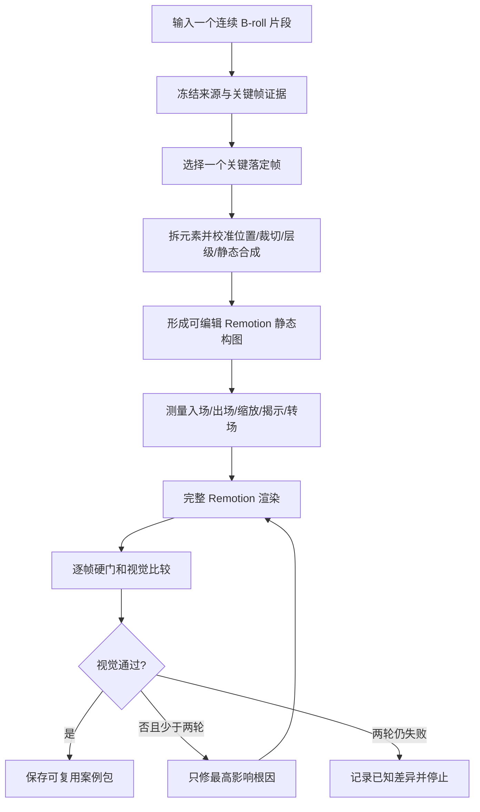

# LJQ B-roll Replica

一个公开的“参考视频 → 可编辑 Remotion 高保真复刻”Skill 项目。它先跑通单个连续 B-roll 镜头的复刻，再把通过验收的元素、布局和剪辑手法留作未来知识库输入。

当前执行框架已接通：案例预检、落定布局、动效取证、Remotion 完整渲染、逐帧 QA 和最多两轮定向修正都能运行。合成端到端回归已通过；真实视觉质量仍需用用户的新参考片测试。仓库中的两个旧案例是研究展示，不是新版确认结果。

## 核心流程



主 Skill 是同一个调度大脑；三个子 Skill 是按阶段加载的专业手册。阶段之间使用同一个案例目录、稳定元素 ID 和 JSON Schema 交接，不依赖聊天记忆。

| Skill | 责任 |
| --- | --- |
| [`ljq-broll-replica`](skills/ljq-broll-replica/SKILL.md) | 初始化、路由、状态、Remotion 渲染、修正上限和交付 |
| [`ljq-broll-layout-structure`](skills/ljq-broll-layout-structure/SKILL.md) | 选择落定帧，拆元素，校准最终排版、裁切、层级和静态合成 |
| [`ljq-broll-motion-forensics`](skills/ljq-broll-motion-forensics/SKILL.md) | 测量入场、出场、平移/旋转、文字顺序、线条揭示和镜头运动 |
| [`ljq-broll-fidelity-qa`](skills/ljq-broll-fidelity-qa/SKILL.md) | 比较完整视频、生成差异证据并把问题归因到责任阶段 |

新版不生成黑白灰格式图，不用 AI 生成参考图片，也不会仅凭像素指标自动宣布高保真通过。落定帧来自原视频；Remotion 代码和组件层级就是可编辑结构。

## 安装

需要 Node.js 20+、Python 3、FFmpeg 和 ffprobe。克隆仓库后运行：

```bash
./scripts/install-local-skills.sh
```

脚本会安装四个 Skill 到 Codex skills 目录，旧版本先移动到带时间戳的可恢复备份，再安装锁定依赖并运行官方 Skill 校验。

## 使用

在新任务中直接调用主 Skill，并给一个连续参考片：

```text
使用 $ljq-broll-replica 复刻这个连续 B-roll 片段：
/absolute/path/to/reference.mp4

请先完成预检和落定布局，再做动效取证、Remotion 完整渲染和 QA；
最多两轮定向修正，保留可替换 props、比较证据和已知差异。
```

如果输入是包含多个剪切点的长视频，应先指定目标时间范围或拆成多个连续镜头案例。

## 已验证的执行链路

- 实际 JSON Schema 2020-12 校验，而不是只读取 schema 文件；
- 案例内源文件存在性、大小和 SHA-256 一致性；
- 布局元素 ID、父子循环、素材路径与动效目标引用；
- 真实 Remotion 打包与 H.264 完整视频渲染；
- 画幅、fps、解码帧数与音频硬门；
- 全帧 RGB 指标和原片/渲染/差异比较图；
- 未经视觉查看只能是 pending；
- 第三次修正被状态机拒绝；
- 最终案例必须通过 `validate-case.mjs --complete`。

运行全部当前回归：

```bash
./tests/contracts/run-contract-tests.sh
./tests/motion/run-motion-tests.sh
./tests/qa/run-qa-tests.sh
./tests/workflows/run-loop-tests.sh
./tests/e2e/run-e2e-smoke.sh
```

具体“已能执行 / 需要 AI 判断 / 尚未建设”的边界见 [执行状态](docs/execution-status.md)，数据接口见 [案例交接合同](docs/contracts/broll-case-contract.md)，产品方向与后续知识库入口见 [主 Skill 实施计划](docs/plans/2026-09-03-broll-replica-master-skill-implementation-plan.md)。

## 研究展示案例

| 案例 | 现有内容 | 证据边界 |
| --- | --- | --- |
| [KIMI K3 关键视觉](examples/kimi-k3-key-visual/README.md) | 参考图、旧版 Scene JSON、生成视频 | 动效主要为推断，未按新版逐帧验收 |
| [Kimi K3 标题动效](examples/kimi-k3-title-motion/README.md) | 旧版 Scene JSON、生成视频、上下对比视频 | 有时序证据，但字体、特效、位置和运动仍有明显差异 |

它们用于保留已经尝试过的结构与失败证据。新版真实案例测试会另建 `workspace/cases/<case-id>/`，不会把旧结果冒充通过。

## 当前不做

多案例知识库、口播自动选点、手法检索和新内容自动调用明确延后。等至少两个不同类型的真实复刻案例通过后，再单独建设下一阶段。

## 许可

项目原创代码、文档和配置使用 [MIT License](LICENSE)。群内协作脚本经贡献者允许纳入公开项目，来源历史记录在 [THIRD_PARTY_NOTICES.md](THIRD_PARTY_NOTICES.md)。案例中的第三方原素材不随 MIT 重新授权。
