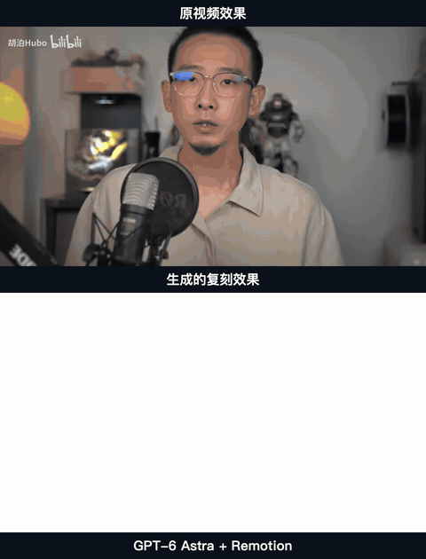
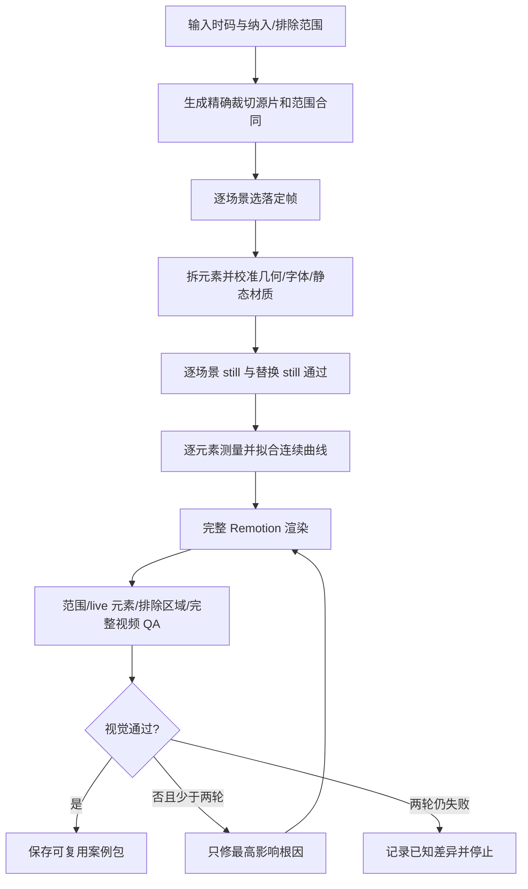

# LJQ B-roll Replica

一个公开的“参考视频 → 可编辑 Remotion 高保真复刻”Skill 项目。一个案例对应用户指定的连续时间范围，范围内的切点和排版变化分别拆成场景；不是文字生成视频，也不是把参考截图铺在成片上。

当前执行框架已接通：精确范围预检、逐场景静帧落定、可替换元素验证、逐元素动效取证、连续曲线检测、Remotion 完整渲染、QA 和最多两轮定向修正。新增 KIMI 0–11 秒真实案例，静态与动态整体效果已获用户认可；其自动保真 QA 仍受时变排除蒙版能力限制，未宣称全部机器门通过。

## 最新案例：GPT-6 Astra + Remotion

使用模型：**GPT-6 Astra**。参考范围：`00:00:00.000–00:00:11.000`，1280×720、30fps、330帧。

下方预览始终上下同步：上方「原视频效果」，下方「生成的复刻效果」，并标注「GPT-6 Astra + Remotion」。人物/A-roll按用户要求在复刻中留白；对比展示中的参考画面不进入Remotion生产组件。



动图仅供快速预览，降低了分辨率与帧率；检查真实节奏请看[完整30fps上下对照视频](examples/kimi-k3-000-011/media/top-bottom-comparison.mp4)。[案例说明、四场景静态对照与源码](examples/kimi-k3-000-011/README.md) · [纯Remotion成片](examples/kimi-k3-000-011/media/generated.mp4)。

本次经验按`writing-for-agents`整理为“主流程＋按需参考＋重复操作脚本”：比例优先、主色角色、对象/属性分类、蒙版关系、真实动效入口、批准基准保护和工具副作用。没有新增第五个Skill。较低成本模型尚未进行同条件视觉制作测试。

## 核心流程



主 Skill 是同一个调度大脑；三个子 Skill 是按阶段加载的专业手册。阶段之间使用同一个案例目录、稳定元素 ID 和 JSON Schema 交接，不依赖聊天记忆。

| Skill | 责任 |
| --- | --- |
| [`ljq-broll-replica`](skills/ljq-broll-replica/SKILL.md) | 初始化、路由、状态、Remotion 渲染、修正上限和交付 |
| [`ljq-broll-layout-structure`](skills/ljq-broll-layout-structure/SKILL.md) | 逐场景落定，拆元素，校准静态画面，生成比较与替换 still |
| [`ljq-broll-motion-forensics`](skills/ljq-broll-motion-forensics/SKILL.md) | 逐元素测量时间、方向、缩放、揭示、文字特效和连续曲线 |
| [`ljq-broll-fidelity-qa`](skills/ljq-broll-fidelity-qa/SKILL.md) | 核对范围、live 元素、排除区域、完整视频并归因差异 |

新版不生成黑白灰格式图，不用 AI 生成参考图片，也不会仅凭像素指标自动宣布高保真通过。落定帧来自原视频；Remotion 代码和组件层级就是可编辑结构。

## 安装

需要 Node.js 20+、Python 3、FFmpeg、ffprobe，以及用于Remotion的Chrome/Chromium。克隆仓库后运行：

```bash
git clone https://github.com/liaojianquan9-source/ljq-broll-video-generator.git
cd ljq-broll-video-generator
./scripts/install-local-skills.sh
```

脚本会安装四个 Skill 到 Codex skills 目录，旧版本先移动到带时间戳的可恢复备份，再安装锁定依赖；本机存在官方Skill校验器时会运行它。需要网络下载依赖，不是只读检查。重新打开任务后调用主Skill；不会自动切换模型，请在客户端模型选择器中选择自己可用的模型。

## 使用

### 第一步：先做静帧，确认后再继续

复制下方提示词，把两个绝对路径和时间范围换成自己的。使用本案例的同款模型时，在客户端选择 **GPT-6 Astra**；提示词里的模型名称本身不会切换模型。

```text
使用 $ljq-broll-replica 做一个可编辑的 B-roll 高保真复刻案例。

参考视频：/absolute/path/to/reference.mp4
精确范围：00:00:00.000–00:00:11.000，共11秒。
案例目录：/absolute/path/to/workspace/cases/my-broll-case

只复刻参考里实际出现的画面，不二创、不重新设计。
纳入文字、数字、参数、线条、图标、容器、背景装饰、贴图和静态效果。
排除人物和A-roll；人物所在区域用纯白表示，不生成或补画人物。

原视频帧、截图和Contact Sheet只能取证，不能作为最终画面覆盖层。
普通文字、数字、参数、线条必须使用live text、SVG、CSS或可编辑组件。
按全部排版变化拆场景，每场选择正确落定帧，每个独立元素建立稳定ID。
优先匹配视觉比例、占屏、留白、层级和参考主色关系，再处理微小纹理差异。
字体不确定时给Top 3候选、对比证据和置信度。
可替换文字、数字、图片和主题色暴露为props，并用替换still验证。

本轮只完成预检、场景与元素拆分、Remotion静态布局。
展示每场source/render/comparison静帧、替换still、字体候选与已知差异。
不要开始动效，不完整渲染视频；等我确认静帧后再继续。
```

上述白底是可修改的范围选择，不是所有视频的固定风格。一个连续区间内有多个切点时仍保留一个案例，分别拆scene；不连续区间或用户明确要求时才分案例。

### 第二步：静帧确认后，继续动效

```text
我已确认当前案例的静帧布局，请继续使用 $ljq-broll-replica。
案例目录：/absolute/path/to/workspace/cases/my-broll-case

先保存批准的静帧、源码、props和帧号，再逐元素取证入场、退出、
转场、缩放、文字效果与图片效果。区分场景、镜头、元素和文字内部行为。
保留已确认的比例、配色、材质、稳定ID和可替换props。
先导出独立的静态回归与动态关键帧，检查长文案替换的终帧，
再完整渲染指定范围，完成技术、live元素、连续性与视觉检查。
最多两轮定向修正，保留证据和已知差异；工具未支持的QA项如实待审。
最终给出原片在上、复刻在下的同步对照，清楚标注实际模型与Remotion。
```

### 第三步：只做回归，不覆盖批准结果

```text
使用 $ljq-broll-replica 检查当前案例的静态回归与替换能力。
案例目录：/absolute/path/to/workspace/cases/my-broll-case
当前已接入动效，请确认实际入口能够关闭动效，再导出每场批准帧。
替换文字：填写新文案；替换图片：填写已授权图片路径。
所有测试输出到新目录，不覆盖批准静帧，不修改原QA状态，不整片重渲染。
分别报告替换机制是否生效、布局是否适配，以及剩余差异。
```

安全探针工具为`render-review-stills.mjs`，先读其`--help`。它要求真实消费`motionEnabled`；通用新模板并未默认具备此入口。默认浏览器路径针对macOS，其他平台需传`--browser-executable`。本案例依赖的macOS字体不随仓库分发，跨机复刻需重验字体与比例。

## 已验证的执行链路

- 实际 JSON Schema 2020-12 校验，包括 1.2 范围、场景、替换、连续性和 QA gates；
- 按用户时码精确裁切案例内源片，解码误差不超一帧；
- 案例内源文件存在性、大小和 SHA-256 一致性；
- 布局元素 ID、父子循环、素材路径与动效目标引用；
- 真实 Remotion 打包与 H.264 完整视频渲染；
- 逐场景 source/render/comparison still 和可替换元素 still 门；
- 连续 bezier 曲线、斜向擦开和叠影文字 runtime；
- 画幅、fps、解码帧数、音频、live 元素和排除区域门；
- 全帧 RGB 指标和原片/渲染/差异比较图；
- 未经视觉查看只能是 pending；
- 第三次修正被状态机拒绝；
- 最终案例必须通过 `validate-case.mjs --complete`。

运行全部当前回归：

```bash
./tests/contracts/run-contract-tests.sh
./tests/preflight/run-preflight-tests.sh
./tests/motion/run-motion-tests.sh
./tests/runtime/run-runtime-tests.sh
./tests/qa/run-qa-tests.sh
./tests/workflows/run-loop-tests.sh
./tests/e2e/run-e2e-smoke.sh
```

具体“已能执行 / 需要 AI 判断 / 尚未建设”的边界见 [执行状态](docs/execution-status.md)，数据接口见 [案例交接合同](docs/contracts/broll-case-contract.md)，产品方向与后续知识库入口见 [主 Skill 实施计划](docs/plans/2026-09-03-broll-replica-master-skill-implementation-plan.md)。

## 案例与证据边界

| 案例 | 现有内容 | 证据边界 |
| --- | --- | --- |
| [KIMI 0–11秒 · GPT-6 Astra + Remotion](examples/kimi-k3-000-011/README.md) | 四场景、42元素、26条motion、11秒成片、上下对照、可编辑源码 | 用户已认可整体效果；自动QA时变排除门仍待审 |
| [KIMI K3 关键视觉](examples/kimi-k3-key-visual/README.md) | 参考图、旧版 Scene JSON、生成视频 | 动效主要为推断，未按新版逐帧验收 |
| [Kimi K3 标题动效](examples/kimi-k3-title-motion/README.md) | 旧版 Scene JSON、生成视频、上下对比视频 | 有时序证据，但字体、特效、位置和运动仍有明显差异 |

后两个旧案例保留为历史研究基线，不代表新版验收结果。新案例展示包不包含全部本地取证中间文件；它不是可直接运行完整case validator的归档。原始完整case继续保留在本地工作区，发布检查见[本次发布记录](docs/qa/2026-09-05-kimi-publication-review.md)。

## 当前不做

多案例知识库、口播自动选点、手法检索和新内容自动调用明确延后。等至少两个不同类型的真实复刻案例通过后，再单独建设下一阶段。

## 许可

项目原创代码、文档和配置使用 [MIT License](LICENSE)。群内协作脚本经贡献者允许纳入公开项目，来源历史记录在 [THIRD_PARTY_NOTICES.md](THIRD_PARTY_NOTICES.md)。案例中的第三方原素材不随 MIT 重新授权。
