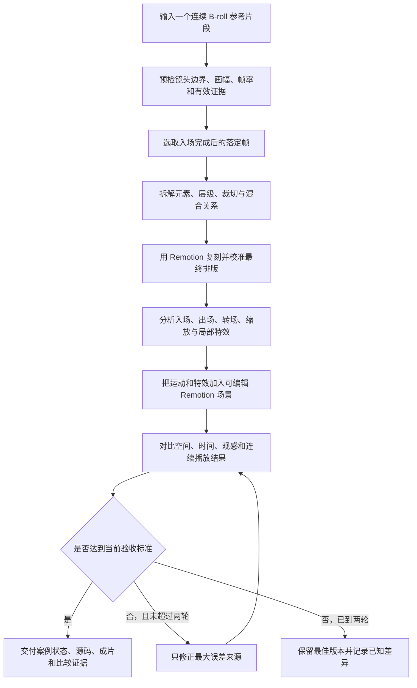

# LJQ B-roll Replica

一个面向“参考视频高保真复刻”的 Remotion Skill 项目。当前先跑通单个连续 B-roll 镜头的复刻流程，再把验收通过的结构、元素和剪辑手法沉淀为可复用案例；口播选点与知识库检索留到下一阶段。

> 当前状态（2026-09-03）：旧版 `ljq-broll-video-generator` 已能完成抽帧、Scene JSON、Remotion 渲染和基础质检；新版“一个主 Skill 统领多个阶段 Skill”的基础层已经建立，但子 Skill、统一渲染链路和高保真验收仍未全部接通。仓库中的两个案例是历史基线，用于暴露问题和后续回归，不代表新版流程已经通过验收。

## 工作流程

新流程采用“先落定帧，后运动；先证据，后实现”的顺序，不再生成黑白灰格式图，也不使用 AI 生成参考图片。



主 Skill 负责维持同一个案例状态并按阶段路由；阶段之间通过稳定元素 ID 和 JSON 文件交接，而不是依赖聊天记忆。详细设计见 [B-roll 高保真复刻主 Skill 实施计划](docs/plans/2026-09-03-broll-replica-master-skill-implementation-plan.md) 和 [案例交接合同](docs/contracts/broll-case-contract.md)。

## 已经做到

### 可运行的旧版最小闭环

- 从参考视频生成元信息、关键帧、逐帧图片和 Contact Sheet。
- 用可编辑 `scene.json` 表达文字、形状、图片、视频、图层和基础运动。
- 使用 Remotion 输出 MP4，并生成开始帧、中间帧、结束帧和质检材料。
- 支持位置、缩放、旋转、透明度、模糊、揭示、父级分组、逐字正文、纹理高亮和文字混合模式等能力。
- 已有两个真实制作过程留下的历史基线案例。

### 新版高保真复刻架构第一阶段

- 建立主 Skill：[`ljq-broll-replica`](skills/ljq-broll-replica/SKILL.md)。
- 确定“主 Skill + 阶段 Skill + 共同案例状态”的组织方式。
- 建立 `case.json`、布局、运动和验收四类 JSON Schema。
- 建立稳定元素 ID、父子引用、运动目标和最多两轮修正的校验器。
- 建立合法/非法案例 fixture 和合同测试。
- 明确图片生成、黑白灰参考图和四轮无差别循环退出新主流程。
- 明确知识库、口播选点和模板自动推荐暂缓，等待复刻流程稳定后再做。

## 两个历史案例

| 案例 | 输入与目的 | 仓库内容 | 证据边界 |
| --- | --- | --- | --- |
| [KIMI K3 关键视觉](examples/kimi-k3-key-visual/README.md) | 单张截图 → 可编辑排版和试验性动效 | 参考图、Scene JSON、生成视频 | 排版来自截图；入场和漂移动效主要是推断，不是原视频逐帧测量 |
| [Kimi K3 标题动效](examples/kimi-k3-title-motion/README.md) | 连续视频片段 → 标题、高亮、辅助文字和正文动效复刻 | Scene JSON、生成视频、原素材/生成效果上下对比 | 有视频时序证据，但字体度量、特效、位置和运动仍存在肉眼可见偏差 |

这两个案例用于保存已经尝试过的结构与失败证据。后续优化应在同一输入上回归对比，而不是只看单独生成画面是否“像一个设计”。

## 后续优化

按当前优先级继续：

1. 完成“落定布局复刻”阶段 Skill：直接使用最终稳定帧，输出分层元素和可校准坐标。
2. 接入“动效取证”阶段 Skill：区分父级运动、局部运动、入场、出场、转场、缩放和视觉特效，并记录证据等级。
3. 让现有 Remotion 渲染器读取新版布局/运动规格，消除新旧数据结构之间的断点。
4. 完成“保真验收”阶段 Skill 和对比脚本，把问题归因到空间、时间、观感或连续性，只循环一到两次。
5. 用两个不同类型的真实视频重新跑完整新流程；在两个案例都通过前，不宣布流程稳定。
6. 流程稳定后，再建设案例库与剪辑手法库，用口播语义匹配可复用元素和动效。

## 主要目录

```text
docs/                         PRD、实施计划、合同与历史设计记录
examples/                     两个历史复刻基线案例
schemas/                      新版共同案例状态的 JSON Schema
scripts/validate-case.mjs     新版案例合同校验器
skills/ljq-broll-replica/     新版复刻主 Skill
skills/ljq-broll-video-generator/
                              仍可运行的旧版 Skill 与 Remotion 渲染器
tests/contracts/              合法/非法案例合同测试
```
