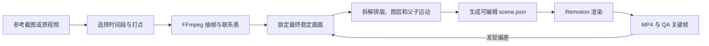

# LJQ B-roll Video Generator

一个基于参考截图、参考视频片段和 Remotion 的可编辑 B-roll 拆解与复刻 Skill。

它用于从原始视频素材中选取需要分析的时间段，通过打点、抽帧和最终画面测量，拆出画面的排版、图层与运动关系；随后生成可修改的 `scene.json`，并由 Remotion 渲染为新的 B-roll 视频和质检关键帧。

当前版本适合“已经有参考素材，希望拆解并复用这种画面”的场景。它暂时不负责自动判断一整条口播的哪句话必须插入 B-roll，也不是一个完整的剪辑软件。

## 工作流程



## 当前能力

- 读取参考截图或指定的视频片段。
- 对参考视频抽取开始帧、中间帧、结束帧、逐帧图片和 Contact Sheet。
- 根据稳定结束帧测量标题、正文、图片、色块等元素的位置和比例。
- 区分父级整体运动与元素内部运动，避免把一组连续动画拆成互相跳动的模块。
- 将二维运动保存为可编辑的 `x`、`y`、`scale`、`rotation`、`opacity`、`blur` 和 `reveal` 轨道。
- 支持逐字正文、轻量“跃进”文字入场、纹理色块和文字混合模式。
- 生成可复用的场景 JSON、Remotion MP4、视频元信息和关键帧质检包。
- 支持把验证通过的画面结构沉淀为模板，再替换文字、素材、位置与时序。

## 临摹方法

本 Skill 使用“先终点，后运动”的方式复刻：

1. 先截图并锁定动画结束后的最终画面。
2. 确定元素的位置、大小、裁切、遮挡和图层关系。
3. 判断视觉变化来自元素自身，还是来自混合、遮罩或背景合成。
4. 校准字号、字距、行距、字体类别、颜色、阴影和图片素材。
5. 最后添加父级进场、元素局部运动和出场。
6. 用原片开始帧、中间帧、结束帧和连续播放结果循环质检。

具体原则见 [`reconstruction-thinking.md`](skills/ljq-broll-video-generator/references/reconstruction-thinking.md)。这些是判断方法，不是针对所有视频的硬编码规则；不同参考素材仍需具体分析。

## 使用的插件与技术

| 组件 | 用途 | 是否为运行依赖 |
| --- | --- | --- |
| Codex Remotion Plugin | 提供 Remotion 创建、标记、预览和渲染最佳实践 | 否，仅用于开发与生成指导 |
| Remotion `4.0.518` | 把 React 场景按帧渲染为视频 | 是 |
| React `19.2.8` | 构建文字、形状、图片和视频图层 | 是 |
| `@remotion/fonts` | 加载本地字体 | 是 |
| FFmpeg / ffprobe | 视频切片、抽帧、Contact Sheet、编码和媒体检查 | 是 |
| Google Chrome | Remotion 本地渲染浏览器；不存在时可尝试使用 Remotion 管理的浏览器 | 可选 |
| Python 3 + PyYAML | Skill 校验和辅助脚本环境 | 是，由安装脚本检查或补充 |

Remotion 插件不会被打包进最终视频，也不是运行本项目的必要条件。实际运行依赖以 `package.json` 和安装脚本为准。

## 环境要求

当前版本主要在 macOS 上开发和验证。

需要安装：

- Git
- Node.js 与 npm
- FFmpeg 与 ffprobe
- Python 3
- 可选：Google Chrome

本次验证环境：

- Node.js `24.13.0`
- npm `11.6.2`
- FFmpeg / ffprobe `8.1`
- Google Chrome `152.0.7977.75`
- Remotion `4.0.518`

## 安装

```bash
git clone https://github.com/liaojianquan9-source/ljq-broll-video-generator.git
cd ljq-broll-video-generator
bash skills/ljq-broll-video-generator/scripts/setup-environment.sh
```

安装脚本会：

- 检查 `node`、`npm`、`ffmpeg`、`ffprobe` 和 `python3`。
- 安装 Remotion 渲染器的 npm 依赖。
- 在项目 `workspace` 内补充 PyYAML，而不修改 Skill 源文件。
- 运行 TypeScript 检查。

## 基本使用

### 1. 准备参考视频

```bash
bash skills/ljq-broll-video-generator/scripts/prepare-reference.sh \
  /absolute/path/reference.mp4 \
  workspace/analysis/reference-name
```

输出包括：

- `metadata.json`
- `start.png`
- `middle.png`
- `end.png`
- `contact-sheet.png`
- `frames/` 逐帧参考

如果原视频包含多个镜头，建议先按时间点切成连续片段，再分别分析。

### 2. 创建或修改场景 JSON

可以从示例开始：

```text
skills/ljq-broll-video-generator/assets/examples/
```

场景格式见 [`scene-format.md`](skills/ljq-broll-video-generator/references/scene-format.md)。`scene.json` 是唯一需要长期维护的可编辑真源。

### 3. 校验场景

```bash
node skills/ljq-broll-video-generator/scripts/validate-scene.mjs \
  /absolute/path/scene.json
```

### 4. 渲染视频

```bash
bash skills/ljq-broll-video-generator/scripts/render-video.sh \
  /absolute/path/scene.json \
  /absolute/path/output.mp4
```

渲染完成后会同时生成：

```text
output.mp4
output.qa/ffprobe.json
output.qa/start.png
output.qa/middle.png
output.qa/end.png
output.qa/contact-sheet.png
```

## 项目结构

```text
skills/ljq-broll-video-generator/
├── SKILL.md                         Skill 入口与工作流
├── agents/openai.yaml               Codex 中的显示信息
├── references/                      场景格式、临摹方法与质检说明
├── scripts/                         环境、抽帧、校验与渲染脚本
└── assets/
    ├── examples/                    可修改场景模板
    └── remotion-renderer/           Remotion / React 渲染工程
```

## 当前边界

- 需要用户或上游流程先提供参考截图、参考片段或时间范围。
- 暂未自动读取完整台词并决定所有 B-roll 插入点。
- 不直接调用剪映；类似文字入场效果使用 Remotion 重新实现。
- 复刻结果以结构、位置、运动关系和可编辑性为重点，不保证素材与字体逐像素完全一致。
- 新画面应根据真实参考判断，不应机械套用已有案例参数。

后续可以继续扩展台词分析、自动选点、模板素材库和批量 B-roll 生成能力。
