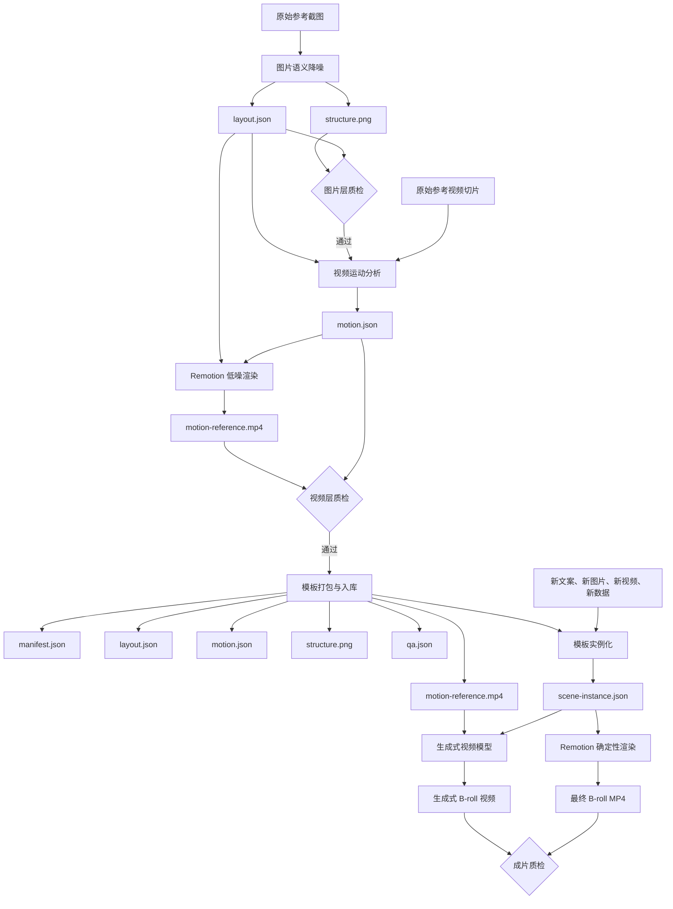

# B-roll 低噪参考库与生成系统 PRD

> 历史状态（2026-09-03）：本文保留早期“低噪结构图/低噪运动参考/先建库”方案及其分析价值，但这些产物不再进入当前主流程。当前先完成直接、可编辑的 Remotion 高保真复刻与两轮 QA 闭环，知识库和口播选点延后；实施以 [`2026-09-03-broll-replica-master-skill-implementation-plan.md`](2026-09-03-broll-replica-master-skill-implementation-plan.md) 为准。

- 文档版本：v0.1
- 日期：2026-09-02
- 状态：待评审
- 适用项目：`ljq-broll-layout-structure`、`broll-layout-video`，以及拟新增的视频运动抽象能力

## 0. 项目根目录与管理约定

本项目后续开发、修改、测试和质检统一以以下目录作为唯一项目根目录：

```text
/Users/liaojianquan/Documents/07_开发项目/AI剪辑_B-Roll
```

建议逐步整理为：

```text
AI剪辑_B-Roll/
├── docs/
│   ├── plans/                 # PRD、设计方案和实施计划
│   └── qa/                    # 跨模板质检规范与质检报告
├── skills/
│   ├── ljq-broll-layout-structure/
│   ├── broll-motion-reference/
│   ├── broll-layout-video/
│   └── broll-script-planner/  # 后续阶段
├── broll-library/
│   ├── index.json
│   └── templates/             # 已通过质检的模板
├── workspace/
│   ├── inputs/                # 当前任务输入，不直接进入正式素材库
│   ├── drafts/                # 尚未通过质检的中间结果
│   └── outputs/               # 当前任务生成的视频
├── tests/
│   ├── fixtures/              # 固定测试输入
│   └── expected/              # 验收基线和关键帧
└── vendor/
    └── remotion-skills.zip    # 外部参考，仅用于研究和选取能力
```

管理规则：

1. `docs/plans/` 保存方向和实施依据，不保存运行产物。
2. `skills/` 保存可维护的 Skill 源码，不直接修改已安装副本作为唯一来源。
3. `broll-library/templates/` 只接收通过质检的模板。
4. 未通过质检的图片、JSON 和视频先进入 `workspace/drafts/`。
5. 外部 Skill 和第三方参考放入 `vendor/`，不与自己的正式 Skill 源码混合。
6. 后续每次整改都在本 PRD 的优化项 ID 下记录，例如 `P0-03`、`P1-06`，便于查找和复盘。
7. 后续安装或发布 Skill 时，从该项目目录同步出去；项目目录始终是可追溯的源文件位置。

## 1. 产品结论

本项目采用“分阶段生产、统一格式衔接、最终一键调用”的架构：

1. 图片降噪负责提取静态布局结构，输出低噪结构图和布局 JSON。
2. 视频降噪负责提取时间、运动和转场，输出运动 JSON 和低噪运动参考视频。
3. 模板入库负责把布局、运动、预览和适用场景包装为可复用 B-roll 模板。
4. B-roll 生成负责用新文案、新图片或新视频填充模板，生成确定性 Remotion 视频，或把低噪参考交给视频生成模型继续创作。
5. 台词分析与自动选点暂不进入第一阶段，作为后续独立能力建设。

现阶段图片降噪和视频降噪应拆成两个独立任务或窗口，分别质检；但二者必须共享元素 ID、坐标系和 JSON 规范。待流程稳定后，再增加统一编排入口，不取消中间产物和质检节点。

## 2. 关键认知

### 2.1 Remotion 的职责

Remotion 是确定性渲染器，不负责自动理解图片。

正确链路是：

> AI 视觉理解或测量脚本读取参考素材 → 写出布局与运动 JSON → Remotion 根据 JSON 生成低噪参考视频或最终 B-roll。

因此，“输入图片后 Remotion 能读取位置”的实际实现，应是上游分析模块读取图片位置，Remotion 消费分析结果。

### 2.2 低噪视频不能成为唯一源文件

低噪 MP4 适合：

- 给人快速查看运动是否正确。
- 给多模态或视频生成模型作为参考。
- 作为素材库中的动态预览。

低噪 MP4 不适合承载精确的元素身份、坐标、时间和可编辑参数。真正的源文件必须是布局 JSON 和运动 JSON。低噪 PNG、低噪 MP4 都是由 JSON 派生出来的可视化产物。

### 2.3 “降噪”的定义

本项目中的降噪不是传统图像去噪，而是语义抽象：

- 删除水印、平台角标、口播字幕、装饰性细节和不可复用内容。
- 保留位置、比例、层级、遮挡、视觉中心和可独立运动元素。
- 将具体人物、品牌、文案和图片替换成语义占位。
- 将复杂动画归纳成少量可编辑运动参数。

为避免歧义，正式产物命名使用“低噪结构图”和“低噪运动参考”，不使用“噪声图”。

## 3. 背景与问题

当前项目已经具备：

- 从截图生成黑白灰语义排版结构图的能力。
- 用布局 JSON 驱动 Remotion 的能力。
- `data-table`、`dialog-focus`、`title-over-video`、`structure-image-motion`、`chapter-subject-media` 五类场景。
- MP4 渲染与基础抽帧检查能力。

当前不足：

1. 静态结构和动态运动尚未形成清晰的数据契约。
2. 视频动效仍较多地写在 `Video.tsx` 场景代码中，难以独立复用。
3. 参考视频的运动规律缺少测量过程，容易依赖目测。
4. 结构图、布局 JSON、运动参数、预览视频和最终模板尚未形成统一素材库目录。
5. 缺少“模板是否真正可复用”的换内容测试。
6. 缺少图片层、视频层和最终成片层的分级质检标准。
7. 尚未建立“台词片段是否需要 B-roll、应该选什么模板”的内容规划能力。

## 4. 产品目标

### 4.1 第一阶段目标

建立一条可人工检查、可逐段修正的完整链路：

> 原始截图/视频 → 低噪结构图 → 布局 JSON → 运动 JSON → 低噪运动视频 → 模板入库 → 新内容填充 → B-roll 输出。

### 4.2 可量化目标

1. 一个已支持模板更换文案和素材时，不修改 TSX 即可重新生成。
2. 每个模板至少用两套不同内容通过复用测试。
3. JSON 中的元素 ID 能从布局阶段一直保持到运动和渲染阶段。
4. 低噪结构图与低噪视频均可以由 JSON 重新生成。
5. 每个入库模板都具有来源记录、适用场景、预览、版本和质检结果。
6. 新增同类 B-roll 时，优先修改 JSON；只有出现新元素或新运动能力时才修改代码。

### 4.3 非目标

第一阶段不实现：

- 自动决定整条视频所有 B-roll 插入点。
- 自动理解任意复杂剪辑并百分之百复刻。
- 把所有视觉风格塞进一个万能模板。
- 仅靠低噪 MP4 反推全部可编辑参数。
- 自动发布或替换正式剪辑时间线。

## 5. 用户场景

### 场景 A：只有一张博主视频截图

用户提供一张截图。系统抽象布局，生成低噪结构图和布局 JSON。若没有对应原视频，系统只能选择默认运动预设，并明确标注运动属于“推断”，不能称为“测量”。

### 场景 B：有截图和对应视频切片

系统先从截图获得稳定布局，再从视频切片提取元素出现时间、移动、缩放、旋转、显隐和转场。Remotion 根据布局和运动 JSON 生成低噪运动参考视频，经质检后入库。

### 场景 C：使用旧模板生成新 B-roll

用户选择模板，提供新文案、人物视频、图片或数据。系统复制模板实例，只替换内容槽、主题和必要参数，渲染新的 B-roll。

### 场景 D：未来根据台词自动规划 B-roll

系统读取台词或逐字稿，判断哪些句子存在解释、对比、数字、人物、地点、产品或转场需求，再从模板库检索匹配模板并生成填充计划。该能力在模板库稳定后建设。

## 6. 方案比较

### 方案 A：只做视频降噪

流程：参考视频 → 直接抽象为低噪视频。

优点：

- 调用步骤少。
- 可以快速获得动态预览。

缺点：

- 元素身份和静态结构不稳定。
- 难以判断问题来自布局还是运动。
- 很难为后续模板填充建立稳定内容槽。
- 视频中的坐标和时间重新编辑成本高。

结论：不采用为主流程，可作为快速草稿模式。

### 方案 B：图片降噪与视频降噪分开

流程：先确定结构，再在相同元素 ID 上挂载运动。

优点：

- 静态和动态问题可以分开质检。
- JSON 更稳定，模板复用更容易。
- 没有视频时仍可完成图片模板。
- 视频分析失败时不会破坏已经确认的布局。

缺点：

- 多一个中间步骤。
- 需要维护布局和运动之间的元素 ID 对应。

结论：推荐采用。

### 方案 C：一个大 Skill 一次完成

流程：输入参考素材 → 黑盒式生成模板和视频。

优点：

- 用户表面操作最简单。

缺点：

- 开发和调试困难。
- 中间结果不可控。
- 一次错误可能同时污染布局、运动和模板。
- 规则会不断堆积到同一个 `SKILL.md`。

结论：第一阶段不采用。成熟后可以增加统一入口，但内部仍保持模块分离。

## 7. 推荐系统架构



## 8. 模块与 Skill 边界

### 8.1 图片结构抽象 Skill

建议继续使用现有 `ljq-broll-layout-structure`。

输入：

- 一张或多张参考截图。

思考：

- 判断画面家族。
- 识别视觉中心。
- 判断元素是否影响布局、遮挡或独立运动。
- 删除不可复用内容。
- 估算百分比位置。

输出：

- `structure.png`
- `layout.json`
- 图片层质检结果

边界：

- 不判断精确运动。
- 不生成最终 B-roll。
- 不把原图具体人物、品牌或正文写死进模板。

### 8.2 视频运动抽象 Skill

建议新增 `broll-motion-reference`。

输入：

- 原始参考视频切片。
- 已通过图片质检的 `layout.json`。
- 可选代表帧或 `structure.png`。

思考：

- 哪些元素实际移动，哪些元素保持静止。
- 元素是平移、缩放、旋转、显隐还是被遮挡。
- 元素出现和消失的顺序。
- 运动属于单元素还是一个分组。
- 线条属于擦除还是整体淡入。
- 文字属于整体进入、顺序进入还是随机散入。
- 结论属于实际测量还是视觉推断。

输出：

- `motion.json`
- `motion-reference.mp4`
- 视频层质检结果

可吸收对方 Skill 的能力：

- 区域位移测量。
- 旋转与平移判断。
- 元素出现时间检测。
- 文字字符出现顺序检测。
- 直线擦除与淡入判断。

### 8.3 B-roll 渲染与生成 Skill

继续演进现有 `broll-layout-video`。

输入：

- 模板目录或模板 ID。
- 新内容和真实素材。
- 可选主题、时长和画幅覆盖参数。

思考：

- 选择哪个模板或 Scene。
- 哪些内容槽必须填充。
- 哪些模板约束必须保持。
- 是否只需改 JSON，还是出现了新的组件能力。
- 使用确定性 Remotion 还是生成式视频模型。

输出：

- `scene-instance.json`
- 最终 B-roll MP4
- 可选独立 TSX
- 成片质检结果

### 8.4 台词与 B-roll 规划 Skill（后续）

建议名称：`broll-script-planner`。

输入：

- 台词、字幕或逐字稿。
- 时间码。
- 可用 B-roll 模板索引。

输出：

- B-roll 候选句。
- 候选时间段。
- 选择理由。
- 推荐模板。
- 需要准备的素材。
- 置信度和人工确认状态。

该 Skill 不直接渲染视频，只负责内容决策。

## 9. 固定数据格式

### 9.1 `layout.json`

负责描述静态结构：

```json
{
  "schemaVersion": "1.0",
  "id": "evidence-board-001",
  "canvas": {
    "width": 1920,
    "height": 1080,
    "unit": "percent"
  },
  "family": "evidence-board",
  "elements": [
    {
      "id": "person-card-primary",
      "type": "media-card",
      "role": "primary-subject",
      "box": [58, 12, 34, 38],
      "zIndex": 30,
      "groupId": "primary-cluster",
      "contentSlot": "primary-person"
    }
  ],
  "focus": ["person-card-primary"],
  "must": ["主卡片为第一视觉中心"],
  "prefer": ["深色背景与高对比主体"]
}
```

要求：

- `id` 在布局、运动和渲染阶段保持一致。
- `box` 统一使用百分比坐标。
- 具体文案和实际素材不写进可复用模板的结构层。
- `must` 记录不可破坏的关系，`prefer` 记录可替换偏好。

### 9.2 `motion.json`

负责描述动态结构：

```json
{
  "schemaVersion": "1.0",
  "layoutId": "evidence-board-001",
  "fps": 30,
  "durationInFrames": 180,
  "tracks": [
    {
      "target": "person-card-primary",
      "preset": "pin-swing-in",
      "start": 8,
      "duration": 28,
      "params": {
        "rotationFrom": 72,
        "rotationTo": 3,
        "scaleFrom": 0.22,
        "scaleTo": 1,
        "swayAmplitude": 1.9,
        "swayPeriod": 150
      },
      "evidence": "measured",
      "confidence": 0.86
    }
  ]
}
```

要求：

- `target` 必须引用 `layout.json` 中存在的元素或组。
- 使用帧作为内部时间单位。
- `evidence` 区分 `measured`、`observed`、`inferred` 和 `default`。
- 不确定的运动不能伪装成精确测量。
- 运动预设只保存少量可编辑参数，不复制大段代码。

### 9.3 `manifest.json`

负责模板检索和版本管理：

```json
{
  "templateId": "evidence-board-001",
  "version": "1.0.0",
  "name": "三人物证据关系板",
  "family": "evidence-board",
  "useCases": ["人物关系", "事件溯源", "公司历史"],
  "contentSlots": ["primary-person", "secondary-person-a", "secondary-person-b"],
  "requiredAssets": ["3 person cards", "background"],
  "layout": "layout.json",
  "motion": "motion.json",
  "structurePreview": "structure.png",
  "motionPreview": "motion-reference.mp4",
  "qa": "qa.json",
  "sourceType": "reference-derived",
  "status": "approved"
}
```

### 9.4 `scene-instance.json`

负责一次具体生产，不修改模板本体：

```json
{
  "templateId": "evidence-board-001",
  "outputId": "nvidia-origin-story",
  "content": {
    "primary-person": {
      "src": "huang.png",
      "title": "黄仁勋"
    }
  },
  "theme": {
    "accent": "#e01c22"
  },
  "overrides": {
    "durationInFrames": 210
  }
}
```

要求：

- 模板和项目实例分开保存。
- 换内容时不直接修改模板。
- 实例只记录与模板不同的内容和覆盖参数。

## 10. B-roll 素材库结构

建议目录：

```text
broll-library/
├── index.json
└── templates/
    └── evidence-board-001/
        ├── manifest.json
        ├── layout.json
        ├── motion.json
        ├── structure.png
        ├── motion-reference.mp4
        ├── contact-sheet.png
        └── qa.json
```

原则：

1. 原始博主截图和原视频不默认复制进模板发布目录。
2. `manifest.json` 记录来源类型、创建日期和必要的内部溯源信息。
3. `structure.png` 和 `motion-reference.mp4` 是预览与模型参考。
4. `layout.json` 和 `motion.json` 是模板真源。
5. `qa.json` 决定模板是否可以进入正式库。
6. 失败版本保留在工作区，不进入 `approved` 索引。

## 11. Remotion 渲染器改造方向

现有 `Video.tsx` 应逐步从“一个文件包含多个场景”改为以下结构：

```text
assets/remotion-renderer/src/
├── components/
│   ├── AnimatedCard.tsx
│   ├── AnimatedText.tsx
│   ├── ConnectorLine.tsx
│   ├── MarkerAnnotation.tsx
│   ├── MediaFrame.tsx
│   └── SemanticPlaceholder.tsx
├── motion/
│   ├── presets.ts
│   ├── easing.ts
│   └── resolve-track.ts
├── scenes/
│   ├── DataTableScene.tsx
│   ├── DialogFocusScene.tsx
│   ├── EvidenceBoardScene.tsx
│   ├── TitleVideoScene.tsx
│   └── ChapterMediaScene.tsx
├── renderers/
│   ├── StructurePreview.tsx
│   ├── MotionReference.tsx
│   └── FinalBroll.tsx
├── registry.ts
├── types.ts
└── Root.tsx
```

职责：

- `components/`：可独立复用的视觉元素。
- `motion/`：运动预设和 JSON 参数解释。
- `scenes/`：元素组合和图层关系。
- `renderers/`：低噪结构、低噪运动和最终成片三种输出模式。
- `registry.ts`：根据模板 family 选择 Scene，避免在 `Video.tsx` 持续增加大型条件分支。

## 12. 质检体系

### 12.1 图片层质检

每一项必须能够回答“通过、失败或不适用”：

- [ ] 输出画幅与原参考或目标画幅一致。
- [ ] 视觉中心数量为一至两个，特殊情况不超过三个。
- [ ] 元素位置和比例与参考布局基本一致。
- [ ] 关键遮挡关系被保留。
- [ ] 同一运动组的元素已经使用稳定 group ID。
- [ ] 水印、平台标识和口播字幕已删除。
- [ ] 具体人物、品牌和长文案已抽象为语义占位。
- [ ] 没有把整张虚化背景错误拆成大量独立元素。
- [ ] 所有元素 ID 唯一且具有语义。
- [ ] `layout.json` 可以通过 schema 校验。
- [ ] `structure.png` 可以由 `layout.json` 重新生成或对应解释。

### 12.2 视频层质检

- [ ] 使用的是单一连续镜头；若存在剪切，已经拆分为多个模板阶段。
- [ ] 帧率、时长和画幅记录正确。
- [ ] 每条运动轨道都能找到对应元素或 group ID。
- [ ] 元素的首次出现和最后消失时间合理。
- [ ] 平移、缩放、旋转和透明度没有混淆。
- [ ] 遮挡造成的像素变化没有被误判为元素移动。
- [ ] 背景静止或移动状态已经说明。
- [ ] 文字进入方式已经区分整体、顺序或随机。
- [ ] 线条已经区分擦除与淡入。
- [ ] 测量结论和推断结论分开记录。
- [ ] 低噪视频中没有带入原参考的具体品牌或敏感内容。
- [ ] MP4 可由 `ffprobe` 正常解析。
- [ ] 起始帧、中间帧、结束帧和 Contact Sheet 已检查。

### 12.3 模板复用质检

- [ ] 模板至少使用两套不同文案和素材渲染成功。
- [ ] 第二套内容只修改 JSON 和素材，不修改 TSX。
- [ ] 替换内容后视觉中心仍然成立。
- [ ] 长文案、极短文案和不同宽高比素材有明确处理策略。
- [ ] 模板没有残留参考视频的具体姓名、品牌或结论。
- [ ] 模板的 `must` 和 `prefer` 能被渲染器正确解释。
- [ ] 缺少必需内容槽时能够明确报错，不生成半成品。
- [ ] 模板版本、状态和质检日期已经记录。

### 12.4 最终成片质检

- [ ] B-roll 与当前台词语义相关。
- [ ] 重要内容在预期时间内可读。
- [ ] 不遮挡必须保留的人物或关键信息。
- [ ] 画面没有超出安全区或被错误裁切。
- [ ] 动画没有突跳、漂位、闪烁或异常模糊。
- [ ] 视频时长、编码、分辨率和帧率符合项目要求。
- [ ] 输出中不存在意外水印、错误文字或旧素材残留。

## 13. 异常与回退策略

### 13.1 只有截图，没有视频

- 正常生成 `layout.json` 和 `structure.png`。
- 从可用预设中选择默认运动。
- `motion.json` 的 `evidence` 标记为 `default` 或 `inferred`。
- 不宣称还原了原视频动效。

### 13.2 只有视频，没有截图

- 先从视频中提取稳定代表帧。
- 代表帧进入图片结构抽象流程。
- 图片层质检通过后再分析视频运动。

### 13.3 视频包含多个镜头

- 先按切点拆分。
- 一个模板只描述一个连续运动逻辑。
- 多镜头组合属于上层剪辑计划，不塞进单个运动模板。

### 13.4 无法准确跟踪元素

- 优先检查遮挡、低纹理区域和镜头运动。
- 无法测量时改为 `observed` 或 `inferred`。
- 保留置信度，不制造虚假的精确数字。

### 13.5 当前渲染器不支持某种元素

- 不在项目 JSON 中绕过类型系统写临时代码。
- 先判断是否需要新增通用组件或 Scene。
- 新能力通过单独样例和回归测试后再进入模板库。

## 14. 分阶段优化清单

以下项目用于后续逐条整改。

### P0：建立稳定链路

#### P0-01 统一术语

- 改造：统一使用“低噪结构图”“布局 JSON”“运动 JSON”“低噪运动参考”“模板实例”。
- 验收：Skill、参考文档和输出目录不再混用“噪声图”等含糊名称。

#### P0-02 冻结布局 JSON v1

- 改造：在当前 layout format 上补充 `schemaVersion`、`canvas`、`family`、`zIndex`、`groupId`、`contentSlot`。
- 验收：现有五种场景均能映射到新格式；旧案例具有迁移策略。

#### P0-03 新增运动 JSON v1

- 改造：定义轨道、目标、预设、起始帧、时长、参数、证据类型和置信度。
- 验收：至少能表达平移、缩放、旋转、透明度、擦除、随机文字进入和分组运动。

#### P0-04 图片阶段独立质检

- 改造：生成 `layout.json` 和 `structure.png` 后停止，等待图片层检查结果。
- 验收：图片失败时不会继续生成运动模板。

#### P0-05 视频代表帧和 Contact Sheet

- 改造：为视频切片固定生成元信息、代表帧和 Contact Sheet。
- 验收：每个视频模板都能快速看到完整时间结构。

#### P0-06 引入可选运动测量工具

- 改造：吸收区域位移、元素时间线和线条采样思路。
- 验收：测量结果可写入 `motion.json`，并明确证据类型。

#### P0-07 建立低噪运动渲染模式

- 改造：Remotion 使用语义占位元素渲染运动，不带入具体人物和品牌。
- 验收：同一 `layout.json + motion.json` 可以重复生成一致 MP4。

#### P0-08 视频阶段独立质检

- 改造：保存关键帧、Contact Sheet 和检查结果。
- 验收：视频层检查失败时模板不能进入 approved 索引。

#### P0-09 建立模板目录规范

- 改造：每个模板固定包含 manifest、layout、motion、静态预览、动态预览和 QA。
- 验收：任意模板目录都可以被自动索引和渲染。

#### P0-10 拆分 Remotion 单体文件

- 改造：把 `Video.tsx` 中的场景、组件和运动逻辑逐步拆开。
- 验收：新增 Scene 不需要修改已有 Scene 内部代码；公共运动组件可以被两个 Scene 复用。

### P1：提高模板生产效率

#### P1-01 建立运动预设库

- 改造：将常用运动固化为带参数的 preset。
- 第一批：`fade-in`、`slide-in`、`scale-settle`、`pin-swing-in`、`local-to-full`、`line-wipe`、`scatter-text`、`media-takeover`。
- 验收：运动 JSON 不保存实现代码，只保存预设名和参数。

#### P1-02 建立可复用动画组件库

- 改造：吸收对方 Skill 中卡片、图钉、文字、红圈和连线的拆分方法。
- 验收：至少两个不同 Scene 使用同一个公共组件。

#### P1-03 增加模板注册表

- 改造：用 `registry.ts` 根据 family 选择 Scene。
- 验收：不再依赖一个不断增长的主文件条件分支。

#### P1-04 模板与实例分离

- 改造：模板不可被项目内容直接覆盖；每次生成创建 `scene-instance.json`。
- 验收：多次生成不会污染原模板。

#### P1-05 内容槽校验

- 改造：模板声明需要哪些文本、图片、视频或数据。
- 验收：缺少必需素材时在渲染前报出可理解的错误。

#### P1-06 双内容复用测试

- 改造：每个模板用两套差异明显的内容进行验证。
- 验收：第二次渲染不修改 TSX，并保持布局和运动意图。

#### P1-07 素材适配策略

- 改造：为横图、竖图、透明 PNG、人物视频、长短文案定义裁切和缩放策略。
- 验收：极端输入不会静默溢出或严重变形。

#### P1-08 建立库索引和标签

- 改造：按场景、视觉中心、素材类型、节奏和适用语义建立索引。
- 验收：可以根据“人物关系”“数字对比”“章节转场”等条件找到候选模板。

#### P1-09 来源与隐私记录

- 改造：记录模板来自原创、参考抽象还是内部实验；原始素材默认不进入发布库。
- 验收：每个 approved 模板来源可追溯，且不意外打包私人原视频。

### P2：从台词自动规划 B-roll

#### P2-01 台词切句和时间码对齐

- 改造：把逐字稿切成可独立表达的语义片段。
- 验收：每个候选片段具有开始时间、结束时间和原文。

#### P2-02 判断 B-roll 机会点

- 改造：识别人物、产品、地点、数字、对比、过程、抽象概念和情绪转折。
- 验收：系统能给出“需要/不需要 B-roll”的理由和置信度。

#### P2-03 台词到模板检索

- 改造：把语义需求映射到模板 family、内容槽和运动节奏。
- 验收：每个候选句返回一至三个模板，不强行只有一个答案。

#### P2-04 素材需求单

- 改造：根据模板内容槽生成需要搜索、拍摄或生成的素材列表。
- 验收：进入渲染前可以看见缺失素材。

#### P2-05 B-roll 编排计划

- 改造：处理相邻 B-roll 的重复、节奏密度和视觉疲劳。
- 验收：不会连续多次使用同一模板，且不会覆盖关键 A-roll 表达。

#### P2-06 人工确认闭环

- 改造：允许逐句接受、替换、跳过或调整时长。
- 验收：任何自动生成都不会未经确认直接覆盖正式剪辑。

## 15. MVP 范围

第一版只完成以下闭环：

1. 选取三个真实参考切片。
2. 每个切片生成低噪结构图和布局 JSON。
3. 每个切片生成运动 JSON 和低噪运动参考 MP4。
4. 至少一个模板使用测量得到的运动数据。
5. 三个模板进入本地 B-roll 库。
6. 每个模板使用两套内容做复用测试。
7. Remotion 输出最终 MP4，并通过三层质检。

建议三个 MVP 模板：

- 居中三级标题。
- 人物/标题/媒体接管。
- 证据关系板或多卡片关系图。

## 16. MVP 验收标准

MVP 完成需要同时满足：

- [ ] 三个模板目录结构一致。
- [ ] 三个模板都有 `layout.json` 和 `motion.json`。
- [ ] 三个模板都有低噪 PNG 和低噪 MP4。
- [ ] 所有 JSON 通过 schema 校验。
- [ ] 所有 MP4 通过 `ffprobe` 检查。
- [ ] 所有模板具有起始、中间和结束帧检查记录。
- [ ] 每个模板都成功替换过第二套内容。
- [ ] 第二套内容没有修改模板 TSX。
- [ ] 低噪参考中没有原博主水印、字幕和具体品牌残留。
- [ ] 测量与推断在数据中明确区分。
- [ ] approved 模板可以通过模板 ID 被调用。

## 17. 风险与控制

### 风险 1：过度还原参考作品

控制：保留布局和运动语法，替换具体人物、文案、品牌、纹理和视觉资产；来源记录为 reference-derived。

### 风险 2：JSON 不断膨胀

控制：只保存会改变渲染决策的字段；复杂逻辑进入组件和运动预设，不在 JSON 中保存代码。

### 风险 3：低噪视频看起来正确，但数据不可编辑

控制：JSON 是真源；每个低噪视频必须可从 JSON 重建。

### 风险 4：图片与视频元素对应错误

控制：图片质检后冻结元素 ID；视频只能引用已有元素或经过明确新增流程。

### 风险 5：一个大 Skill 越来越难维护

控制：图片结构、视频运动、最终生成和台词规划分成独立 Skill；统一入口只做路由和编排。

### 风险 6：模板只适合原参考内容

控制：模板入库前强制进行第二套内容复用测试。

## 18. 推荐开发顺序

1. 统一术语和目录命名。
2. 在现有布局 JSON 上冻结 v1 schema。
3. 定义 motion JSON v1。
4. 给图片 Skill 增加 JSON 输出和质检清单。
5. 创建独立的视频运动抽象 Skill。
6. 引入视频抽帧、Contact Sheet 和基础测量能力。
7. 给 Remotion 增加低噪运动参考渲染模式。
8. 拆分 `Video.tsx` 为 components、motion、scenes 和 registry。
9. 建立模板目录与 `manifest.json`。
10. 完成三个 MVP 模板。
11. 对每个模板做双内容复用测试。
12. 建立 approved 模板索引。
13. 流程稳定后增加统一调用入口。
14. 最后再开发台词分析和自动模板推荐。

## 19. 推荐工作方式

开发阶段建议使用三个独立任务窗口：

### 窗口一：图片结构抽象

只负责：截图 → `layout.json` + `structure.png` → 图片质检。

### 窗口二：视频运动抽象

只负责：原视频 + 已确认布局 → `motion.json` + `motion-reference.mp4` → 视频质检。

### 窗口三：模板生成与复用

只负责：模板 + 新内容 → `scene-instance.json` → 最终 B-roll → 成片质检。

这样能够明确定位错误：

- 位置或层级错误，回到窗口一。
- 时间或运动错误，回到窗口二。
- 内容替换、渲染或成片错误，回到窗口三。

流程成熟后，可以再创建一个统一任务入口自动串联三个阶段，但仍然输出全部中间文件并保留质检结果。

## 20. 最终产品形态

系统成熟后的调用方式应当是：

1. 用户输入一张截图，或一张截图加对应视频切片。
2. 系统生成低噪结构和低噪运动参考。
3. 用户逐层确认布局与运动。
4. 系统把通过质检的结果保存为 B-roll 模板。
5. 下次用户输入一句内容和所需素材。
6. 系统从模板库选择或调用固定格式。
7. 用户只修改内容槽和少量参数即可生成新 B-roll。
8. 后续台词规划模块负责判断“哪句话需要 B-roll”，模板系统负责判断“该用哪一种 B-roll”。

最终原则：

> 图片负责结构，视频负责运动，JSON 负责可编辑性，Remotion 负责确定性输出，低噪视频负责预览和模型参考，素材库负责长期复用，台词模块负责未来的自动选点。
