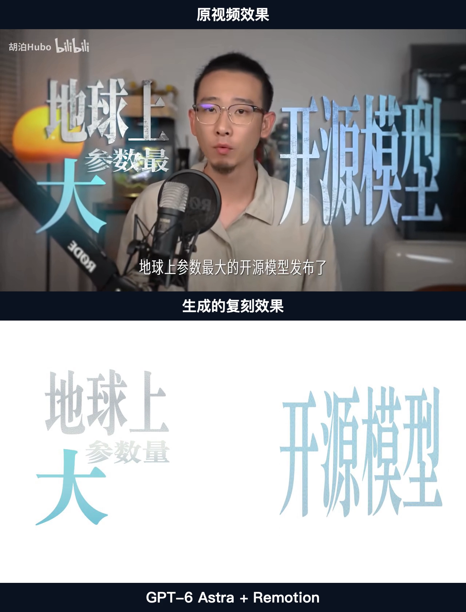
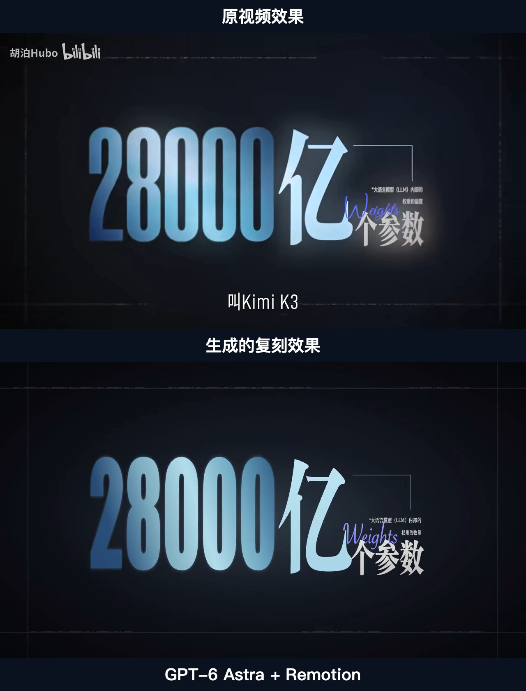
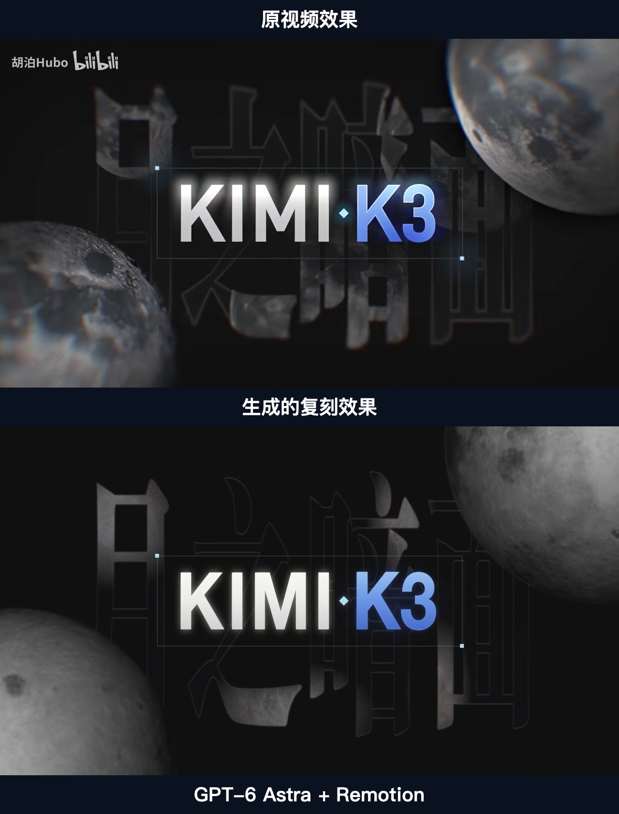
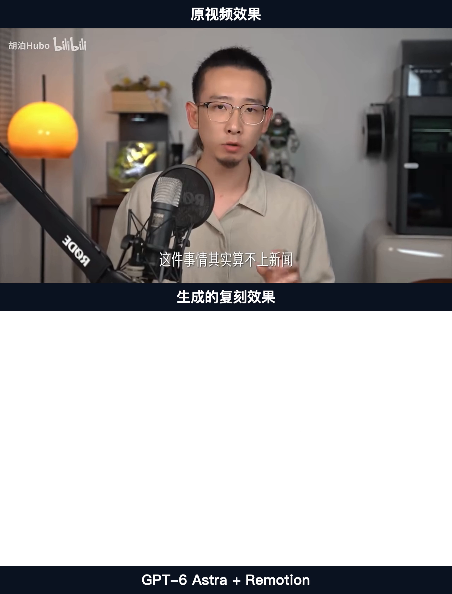
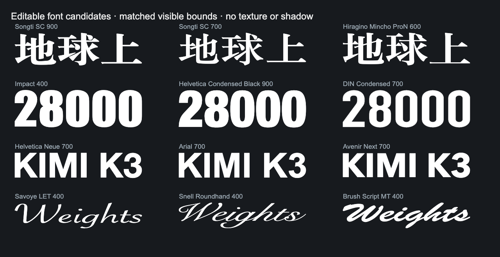

# KIMI 0–11秒：GPT-6 Astra + Remotion

使用模型：**GPT-6 Astra**。实现工具：**Remotion 4.0.518**。测试日期：2026-09-05。

这是按参考视频逐场景、逐元素取证后完成的分层复刻。用户已明确认可静态与动态整体效果，接受少量瑕疵；不是原工程参数恢复，也不宣称完全一致。

## 上下同步效果

上方为「原视频效果」，下方为「生成的复刻效果」，底部写明「GPT-6 Astra + Remotion」。两幅画面保持16:9，标签在独立条带中；所有对照使用同一逻辑帧，没有挪动时间来让局部画面更相似。


动图为480像素宽、10fps的完整11秒预览，不用于精确判断时序。查看[完整30fps上下对照视频](media/top-bottom-comparison.mp4)，或[纯Remotion生成视频](media/generated.mp4)。

## 案例范围

| 项目 | 内容 |
| --- | --- |
| 参考 | 用户提供的《KIMI K3：国产AI追上来了吗》视频文件；画面水印为“胡泊Hubo / bilibili”，原始发布链接未随测试提供 |
| 精确范围 | `00:00:00.000–00:00:11.000` |
| 画幅／帧率／帧数 | 1280×720／30fps／330帧；原片选段和成片均无音轨 |
| 纳入 | 文字、数字、单位、参数、线条、节点、容器、贴图、背景字、渐变、纹理、阴影、辉光与动态效果 |
| 排除 | 人物、A-roll；按用户要求用纯白表示，不生成或补画人物。原片烧录字幕与频道标识不作复刻目标 |
| 主色 | 按参考保持蓝白角色和明暗关系；异色props仅用作替换测试 |
| 结构 | 4个排版场景、42个元素ID（包含2个结构父组）、26条motion记录 |

原片、截图和对照媒体仅用于展示与取证。生产组件使用live文字、SVG、CSS、独立月面素材及可编辑props，不加载参考视频或截图。上下比较媒体不属于生产组件。

## 四个场景的静态对照

以下PNG均从同一上下对照视频按零基帧号提取，下方是**最终动态成片在该时刻的画面**，不是另换一张更理想的静态布局。

| 场景 | 对照帧／时间 | 内容 |
| --- | --- | --- |
| 开头标题 | 82／2.733秒 | 地球上、参数量、大、开源模型；人物区域白底 |
| 参数页 | 164／5.467秒 | 28000、亿、个参数、括线、小注、Weights |
| 月球标题 | 247／8.233秒 | KIMI K3、月之暗面纹理字、月球、线框与节点 |
| 口播排除页 | 329／10.967秒 | 原片回到人物口播，复刻为约定的纯白，不是漏渲染 |

### 开头标题：原视频在上，生成效果在下



### 参数页：原视频在上，生成效果在下



### 月球标题：原视频在上，生成效果在下



### 口播排除页：原视频在上，生成效果在下



## 实际实现与可替换内容

- [composition.tsx](remotion/composition.tsx)：live文字、字形遮罩、线框、图像裁切、材质和四场景组成。
- [motion-state.tsx](remotion/motion-state.tsx)与[motion.json](specs/motion.json)：逐字、镜头、独立元素、场景交叠与穿字淡化；这是实际被入口导入的实现。
- [schema.ts](remotion/schema.ts)：文字、数字、单位、图片、字体、主题色，以及`motionEnabled`静态开关。
- [元素摘要](elements.json)：42个元素的场景、父组、类型和可替换标记。摘要不是完整case合同。
- [独立月面素材与署名](remotion/public/moon/SOURCES.md)：素材不是原视频裁图；纹理经live文字mask显示。

若只想使用Skill处理自己的视频，直接复制[仓库首页的三段调用提示词](../../README.md#使用)。先确认静帧，再接动效；不要把本片配色、位置或时码套到新片。

如需运行本例源码，先确保本机有对应字体和Chrome/Chromium，在本目录执行：

```bash
npm ci
npm run still -- --browser-executable="/absolute/path/to/chrome"
npm run render -- --browser-executable="/absolute/path/to/chrome"
```

在macOS常见Chrome路径为`/Applications/Google Chrome.app/Contents/MacOS/Google Chrome`。命令输出到`output/`，不覆盖发布的`media/generated.mp4`。`npm run still`默认是动态第247帧；静态回归可追加`--props='{"motionEnabled":false}'`，替换示例可追加`--props='{"motionEnabled":false,"kimiTitle":"EDITABLE"}'`。先看生成结果，不能只凭退出码认定视觉通过。

该目录是精选展示和可运行源码包，不包含本地全部原片、逐帧取证、旧修正轮次、批准静态/替换still或QA机器归档。`motion.json`保留原证据路径作溯源描述；这些取证文件不全部随展示包发布，因此不要对此目录直接运行完整case validator。

### 重新生成上下对照

仅需查看效果时直接打开media即可。重新生成展示需自行提供已授权、与成片同步的11秒参考选段。脚本使用Node.js、FFmpeg、ffprobe及macOS Swift/AppKit；后者只绘制中文标签条，属于本机FFmpeg没有drawtext时的可重复替代方案，不是通用Skill的额外依赖。

```bash
node tools/make-comparison.mjs \
  "/absolute/path/to/reference-000-011.mp4" \
  "media/generated.mp4" \
  "output/comparison"
```

脚本核对两段输入均为1280×720、30fps、330帧，拒绝覆盖已有同名输出。所用[脚本](tools/make-comparison.mjs)、[中文标签绘制](tools/render-labels.swift)及[原始发布媒体清单](media/publication-manifest.json)均保留；媒体合成通过不代表自动保真QA通过。

## 字体候选与已知差异

| 内容 | Top 3候选 | 置信度与判断 |
| --- | --- | --- |
| 中文标题 | Songti SC Black / Songti SC Bold / Hiragino Mincho ProN W6 | 中／低／低；前者衬线和粗细对比更接近，端点仍有差异 |
| 28000数字 | Impact / Helvetica Neue Condensed Black / DIN Condensed Bold | 均中；数字开口、字腔和主干比例不同 |
| KIMI K3 | Helvetica Neue Bold / Arial Bold / Avenir Next Bold | 中／中／低；比较M交点、K斜线与字面占位 |
| Weights | Savoye LET / Snell Roundhand / Brush Script MT | 均低；连笔、W高度和笔画粗细不能精确匹配 |



这些是本机字体候选，不是原始字体的精确识别；字体文件不随包分发。换电脑或换字体后必须重验字面边界、比例和换行。月面坑纹、二维光照、数字内部扫光、手写显影与原片存在近似；边界时间约有1–2帧不确定性。替换演示中“性能值”与“强”的局部重叠已被用户接受为次要问题，不代表任意长文案均自动适配。

## 验收状态

用户已接受整体观感；本机已做媒体技术检查、live元素审查、连续性和关键帧/播放检查。**自动保真QA仍为待审**：现有比较器只有单张静态排除mask，不能准确表达本片随场景和穿字转场变化的人物排除区。

没有用全黑占位或大范围遮罩绕过该限制，也没有把人工认可写成全部自动门通过。较低成本模型未做同条件实际制作对照。

## 本次如何沉淀到Skill

比例/主色判断归layout；文字、媒体、形状、组与共享属性分轴；蒙版记录合成关系；动态检查实际入口、轨道scope与变换顺序；工具手册标明副作用和失败分支；复用脚本保护批准基准。详见[本次发布复查](../../docs/qa/2026-09-05-kimi-publication-review.md)。

参考画面及第三方字体不随项目MIT许可重新授权，见[第三方声明](../../THIRD_PARTY_NOTICES.md)。
